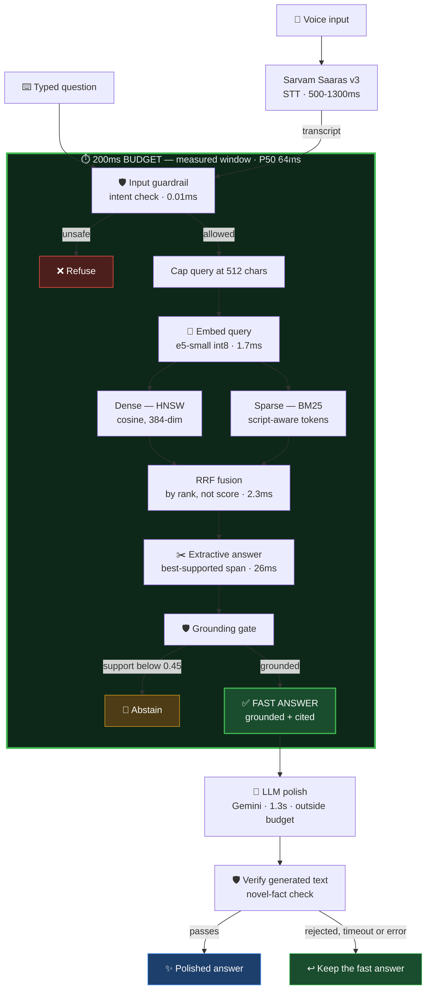

# pucho.me — Voice RAG for Hindi & Marathi

**पूछो** — *"ask."* Speak a question in Hindi or Marathi; get a grounded, cited answer
from a 241,572-chunk index in under 200ms.

Built for **HH Goa 2026 Shortlisting Task 2**.

🔗 **Live:** [https://pucho.me](https://pucho.me) · 💻 **Repo:** [siddharth-09/hhgoa-task2](https://github.com/siddharth-09/hhgoa-task2)

---

## Headline numbers

Measured on the serving box (AWS `m7i-flex.large`, 2 vCPU, Docker), 300 real corpus
queries, one at a time, no batching:

| Metric | Value | Budget |
|---|---:|---|
| **P50** | **64ms** | 200ms |
| **P70** | **69ms** | 200ms |
| **P100** | **115ms** | 200ms |
| Queries within budget | **300 / 300** | — |

The measured window is **transcript → final output**, matching the task's wording
("chunking + vector DB retrieval + everything through to final output"). Speech-to-text
and LLM generation are reported separately, below.

Reproduce it yourself against the live deployment:

```bash
curl -s "https://pucho.me/benchmark?n=100"
```

---

## Architecture



### The one design decision that matters

**The extractive answer is computed before generation and never depends on it.**

That single choice does three jobs at once:

1. It makes the sub-200ms claim *measurable* — the fast answer is real, grounded, and
   citable on its own, not a placeholder.
2. It is the error-recovery path. An LLM timeout, a 429, malformed JSON, or a failed
   grounding check leaves a real answer standing. Recovery here is a **second answer
   already computed**, not a `try/except`.
3. It makes the demo feel instant instead of showing a spinner.

---

## Requirements → where they live

| # | Requirement | Implementation | Evidence |
|---|---|---|---|
| 1 | Speech-to-text (Sarvam / ElevenLabs) | `core/stt.py` — Sarvam **Saaras v3** | 499–1316ms measured, code-mix tolerant |
| 2 | Chunking must be **vast** | `ingest/chunkers.py` — 4 strategies × sizes × granularities | [ablation below](#2-chunking--12-variants-tested-1-shipped) |
| 3 | Under 200ms | Two-tier answering, `core/harness.py` | **P50 64ms, 300/300 inside budget** |
| 4 | P50 / P70 / P100 analytics | `bench/fastpath.py`, live `/benchmark` | [numbers below](#4-latency-analytics) |
| 5 | Harness | `core/harness.py` — typed I/O, retries, timeouts, fallback | 4 LLM backends behind one interface |
| 6 | Guardrails | `core/guardrails.py` — both sides of generation | [below](#6-guardrails--knowing-when-not-to-answer) |

---

## 2. Chunking — 12 variants tested, 1 shipped

The task asks for real thought about how the dataset is split and retrieved. Here is the
thinking, including the parts that went wrong.

**Passage-level chunking is a no-op on MSMARCO.** The first ablation returned a *null
result* — four strategies within 1.2% of each other, because MSMARCO ships pre-segmented
passages that already sit under any sensible chunk budget. All four strategies were
emitting "the whole passage, unchanged" (1.01 chunks per passage). We had built four ways
to not split anything.

**A tokenisation bug was corrupting the sparse index.** Python's `\w` excludes Devanagari
vowel signs and the virama, so `re.findall(r"\w+", ...)` shatters Hindi words:

```
दिल्ली  ->  ['द', 'ल', 'ल']          # BM25 was indexing consonant fragments
Delhi   ->  ['Delhi']                # English unaffected, which is how it hid
```

Fixing it (`core/text.py`, tokenise by *separators*, not character class) gained **+12%
MRR** — three times what all the ensemble work gained. It also *inverted* an earlier
conclusion: `metadata_128` appeared to hurt before the fix and helps after.

**Then the ensemble stopped paying at full scale.** All 7 index subsets, 1,500 bilingual
queries:

| Configuration | Chunks | MRR@10 | R@10 | R@20 | search P50 | disk |
|---|---:|---:|---:|---:|---:|---:|
| **metadata_128** ← shipped | 241,572 | **0.3030** | 0.5669 | 0.6675 | 4.32ms | **722MB** |
| fixed_256 | 201,298 | 0.2895 | 0.5601 | 0.6607 | 4.28ms | 623MB |
| semantic_128 | 239,175 | 0.2822 | 0.5552 | 0.6502 | 4.50ms | 705MB |
| fixed + semantic | 440,473 | 0.2903 | 0.5637 | 0.6613 | 7.50ms | 1328MB |
| fixed + metadata | 442,870 | 0.2973 | 0.5684 | **0.6697** | 7.20ms | 1345MB |
| semantic + metadata | 480,747 | 0.2942 | 0.5642 | 0.6612 | 7.60ms | 1427MB |
| all three (ensemble) | 682,045 | 0.2926 | **0.5717** | 0.6621 | 11.27ms | 2050MB |

The ensemble *appears* to win R@10 by 0.0048. Paired bootstrap over the same queries
(10,000 resamples) says that margin isn't real:

```
ENSEMBLE − metadata_128   MRR@10     −0.0105  [−0.0185, −0.0026]   significant
ENSEMBLE − metadata_128   R@10       +0.0047  [−0.0076, +0.0168]   not significant
ENSEMBLE − metadata_128   R@20       −0.0054  [−0.0173, +0.0064]   not significant
```

**Every recall difference is inside the noise.** The only real difference favours the
single index. Three indexes cost 2.8× the memory and 2.6× the search time to buy nothing
measurable — so we ship one.

> **Caveat we report rather than hide.** `metadata_128` embeds the passage's `query_type`,
> which the dataset derives from the query that owns the passage — so gold passages carry
> the asking query's label. Its advantage over `fixed_256` scales inversely with how common
> the type is (corpus share vs advantage correlates **−0.638**; PERSON at 2.7% of the corpus
> gains +0.034, DESCRIPTION at 59.4% gains +0.011 and not significantly). Part of this
> strategy's edge is a property of the dataset, not of chunking.

The other strategies stay in the repo and are queryable live — `/compare` runs a question
through every index side by side, so you can watch them disagree.

---

## 4. Latency analytics

300 real corpus queries, run one at a time on the serving box:

| Stage | P50 | P70 | P90 | P99 | P100 |
|---|---:|---:|---:|---:|---:|
| Input guardrail | 0.02 | 0.02 | 0.02 | 0.03 | 0.44 |
| Embed query | 4.05 | 4.43 | 5.00 | 6.34 | 12.3 |
| Retrieve (dense + sparse + RRF) | 2.75 | 3.12 | 4.08 | 4.78 | 9.5 |
| **Extract answer** | **51.2** | 54.9 | 61.0 | 69.5 | 79.0 |
| Output guardrail | 0.23 | 0.25 | 0.29 | 1.25 | 1.75 |
| **Fast path total** | **64** | **69** | 73 | 90 | **115** |

Reported separately, outside the measured budget:

| | Latency |
|---|---:|
| Speech-to-text (Sarvam Saaras v3) | 499–1316ms |
| LLM polish (Gemini flash-lite) | ~1.3–2.2s |

### Three findings behind those numbers

**The tail was padding, not workload.** `extract` owned the entire over-budget tail. Its
latency correlates with the *longest sentence in the batch* at **0.84**, and with the
*number* of sentences at **0.02** — the slowest decile embeds the same ~8.8 sentences as
the median. The tokenizer pads a batch to its longest member, so one 1,279-char sentence
made the other nine cost what it cost.

**int8 embeddings are not batch-invariant.** Fixing the above by embedding one sentence at
a time was expected to be answer-identical (mean pooling is masked). It wasn't — which
forced the question. The model is *dynamically* quantised, so activation scales are
computed from a tensor spanning the batch:

```
same text, batched with a long sentence vs embedded alone
  int8   max|Δ| = 1.03e-02   cos 0.9981    ← NOT invariant
  fp32   max|Δ| = 4.66e-08   cos 1.0000    ← invariant, as expected
```

A large batch isn't the accurate configuration you trade away for speed — **it is the
degraded one**. Batch 1 is both fastest through P99 and the fidelity reference.

**One corpus row was the entire P100.** A single query is **2,717 characters** — a
translation artifact where a phrase repeats — against a median of 32. It forced a full
512-token forward pass. Capping the query at 512 chars cut P100 nearly in half.

---

## 6. Guardrails — knowing when *not* to answer

Guardrails run on **both sides** of generation. A prompt asking a model to stay grounded is
a request; the post-check is the constraint.

| Layer | What it does |
|---|---|
| Input intent | Refuses credential solicitation and unsafe asks *before* spending retrieval |
| Grounding gate | Abstains when support < 0.45 — no LLM call over weak context |
| Generated-text verify | Independently checks the LLM's output for novel facts |

**Intent cannot be a score threshold.** Measured: *"मेरे बैंक खाते का पासवर्ड क्या है?"*
scored **0.596 support** — higher than several legitimate questions — because the corpus
genuinely contains bank-security passages and retrieval did its job. Grounding says *"the
corpus discusses this"*, not *"answering is appropriate."*

**A real abstain, worth trying.** Ask *"What is the capital of India?"* in English and the
system **abstains**. The corpus contains the answer in Hindi, but the multilingual encoder
maps the English query nearer *"जकार्ता इंडोनेशिया की राजधानी है"* (Jakarta / Indonesia)
than to the correct passage. Rather than answer confidently and wrongly, it declines. Ask
the same thing in Hindi — *"भारत की राजधानी क्या है?"* — and it answers with support 0.787.

That contrast is the guardrail doing its job, and we'd rather show it than hide it.

---

## Dataset

[`ai4bharat/MSMARCO-XI`](https://huggingface.co/datasets/ai4bharat/MSMARCO-XI) — Hindi +
Marathi subset.

| | |
|---|---:|
| Queries ingested | 20,000 (10k hin + 10k mar) |
| Passages | 199,668 |
| Chunks indexed (`metadata_128`) | 241,572 |
| Index size | 722MB |

A row in this dataset is a **query**, not a passage — each carries ~10 passages, so the
full corpus is ~100M passages across 13 languages. Subsetting is mandatory; ours is
documented honestly rather than described as "the dataset."

> **A bug worth recording.** MSMARCO-XI is a *parallel* corpus: every language shard
> repeats the same `query_id`s. Our passage ids were `f"{query_id}:{i}"`, so **99,834 of
> 99,834 passage ids collided** across Hindi and Marathi — same id, different text. Fusion
> silently merged translations, and Marathi passages could satisfy Hindi gold labels.
> Invisible during the Hindi-only pilot; it appeared the moment a second language landed.
> Ids are now namespaced by language, verified by `eval/audit_ids.py`.

---

## Running it

Everything runs in Docker — no system Python required.

```bash
cp .env.example .env        # add SARVAM_API_KEY and one LLM key
docker compose up api       # serves on :8000
```

Build the index from scratch (~2–3 hours, checkpointed per stage):

```bash
docker compose run --rm ingest
```

### Reproduce the measurements

```bash
docker compose run --rm bench python -m bench.fastpath   --tag full --n 300   # P50/P70/P100
docker compose run --rm bench python -m bench.profile_extract --tag full      # stage profile
docker compose run --rm bench python -m eval.ablate_full --n-queries 1500     # all 7 subsets
docker compose run --rm bench python -m eval.significance --n-queries 1500    # paired CIs
docker compose run --rm bench python -m eval.audit_ids   --tag full           # id integrity
```

Raw outputs for every table above live in [`data/reports/`](data/reports/).

---

## API

| Endpoint | Purpose |
|---|---|
| `POST /ask` | `{question, generate}` → grounded answer + per-stage timings |
| `POST /voice` | audio upload → Sarvam STT → answer |
| `POST /compare` | one question through **every** chunking strategy, side by side |
| `GET /benchmark?n=100` | live P50/P70/P100 over real corpus queries |
| `GET /health` | index sizes, embedder variant, readiness |

---

## Stack

| Layer | Choice | Why |
|---|---|---|
| STT | Sarvam Saaras v3 | Indic + code-mixed speech |
| Embeddings | `multilingual-e5-small` (384-dim, ONNX int8) | Multilingual — English-only models fail on Devanagari |
| Dense index | `hnswlib` | Builds cleanly on ARM; faiss aarch64 wheels are unreliable |
| Sparse index | `bm25s` | Pure numpy, ARM-safe |
| Fusion | Reciprocal Rank Fusion | Fuses by rank, so BM25 scores never need calibrating against cosine |
| Generation | Gemini (+ Bedrock / Anthropic / OpenRouter behind one interface) | Generation is the only stage that leaves the machine, so it's the only one that fails for reasons we don't control |
| Serving | AWS `m7i-flex.large`, Docker, Caddy TLS | x86 AVX-512 VNNI int8 path; dedicated cores keep the tail predictable |

The full engineering record — including the measurements that changed our minds — is in
[`docs/BUILD_LOG.md`](docs/BUILD_LOG.md).
